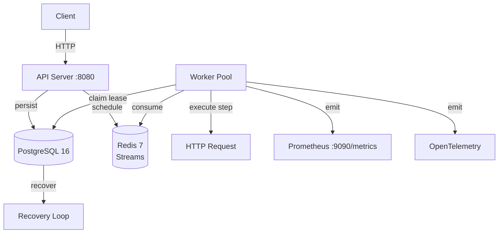

# AetherFlow


AetherFlow is a durable workflow engine for automation, written in Go 1.22+. It stores workflow definitions and execution state in PostgreSQL, schedules work through Redis Streams, executes durable steps, exposes Prometheus metrics, and emits OpenTelemetry traces.

---

## System Architecture



The API server handles definition and instance management. Workers claim leases, consume Redis streams, execute steps, and persist state. A recovery loop re‑enqueues orphaned instances on restart.

---

## Quick Start (3 steps)

1. **Start the environment**
   ```bash
   docker compose up --build
   ```

2. **Create a workflow definition** (using the example order processing saga – see below)
3. **Start an instance** and query its status.

---

## Running the Environment

```bash
docker compose up --build
```

**Services:**

| Service         | URL / Port                     |
|-----------------|--------------------------------|
| API             | http://localhost:8080          |
| Metrics         | http://localhost:9090/metrics  |
| PostgreSQL 16   | localhost:5432                 |
| Redis 7         | localhost:6379                 |

---

## Environment Variables

Create a `.env` file (or rely on defaults) with the following variables:

```bash
# PostgreSQL
POSTGRES_HOST=postgres
POSTGRES_PORT=5432
POSTGRES_DB=aetherflow
POSTGRES_USER=admin
POSTGRES_PASSWORD=changeme

# Redis
REDIS_ADDR=redis:6379

# API authentication (comma‑separated: token=tenant:role)
# When empty, runs in local development mode as default/admin
API_KEYS=

# HTTP step security (set to true only for trusted internal networks)
ALLOW_PRIVATE_HTTP=false
```

---

## API Endpoints

| Method | Endpoint                     | Description                                      | Required Role |
|--------|------------------------------|--------------------------------------------------|---------------|
| GET    | `/healthz`                   | Liveness probe                                   | none          |
| GET    | `/readyz`                    | Readiness probe (checks PostgreSQL and Redis)   | none          |
| POST   | `/definitions`               | Create a workflow definition                     | admin         |
| POST   | `/instances`                 | Start an instance from a definition ID          | operator      |
| GET    | `/instances/:id`             | Get instance state, history, and payload        | reader        |

**Authentication:** Enabled when `API_KEYS` is set. Format: `token=tenant_id:role` where role is `admin`, `operator`, or `reader`. When `API_KEYS` is empty, the service runs in local development mode as `default/admin`.

**Authorization:** Tenant‑scoped. Definitions, instances, and execution history are read and written through the tenant attached to the API key.

---

## Example: Order Processing Saga

### Create a definition

```bash
curl -sS -X POST http://localhost:8080/definitions \
  -H 'Content-Type: application/json' \
  -d @- <<'JSON'
{
  "name": "Order Processing Saga",
  "version": 1,
  "steps": [
    {
      "id": "reserve_inventory",
      "type": "http_request",
      "config": {
        "url": "https://httpbin.org/post",
        "method": "POST",
        "headers": {"Authorization": "Bearer {{.input.token}}"},
        "body": {"items": "{{.input.order.items}}"}
      },
      "retry": {"max_retries": 3, "initial_interval": "1s", "max_interval": "10s", "multiplier": 2.0},
      "on_failure": "release_inventory"
    },
    {
      "id": "process_payment",
      "type": "http_request",
      "config": {
        "url": "https://httpbin.org/post",
        "method": "POST",
        "body": {"amount": "{{.input.order.amount}}", "card_token": "{{.input.payment.token}}"}
      },
      "retry": {"max_retries": 2, "initial_interval": "500ms"},
      "on_failure": "reverse_payment"
    },
    {
      "id": "release_inventory",
      "type": "http_request",
      "config": {
        "url": "https://httpbin.org/post",
        "method": "POST",
        "body": {"reservation_id": "{{.steps.reserve_inventory.body.reservation_id}}"}
      }
    },
    {
      "id": "reverse_payment",
      "type": "http_request",
      "config": {
        "url": "https://httpbin.org/post",
        "method": "POST",
        "body": {"charge_id": "{{.steps.process_payment.body.charge_id}}"}
      }
    },
    {
      "id": "notify_customer",
      "type": "condition",
      "config": {
        "if": "steps.process_payment.status == 'completed'",
        "then": "send_email",
        "else": null
      }
    },
    {
      "id": "send_email",
      "type": "http_request",
      "config": {
        "url": "https://httpbin.org/post",
        "method": "POST",
        "body": {"to": "{{.input.order.customer_email}}", "template": "order_confirmation"}
      }
    }
  ]
}
JSON
```

**Response (201 Created):**
```json
{
  "definition_id": "def_123456",
  "name": "Order Processing Saga",
  "version": 1
}
```

### Start an instance

```bash
curl -sS -X POST http://localhost:8080/instances \
  -H 'Content-Type: application/json' \
  -d '{
    "definition_id": "def_123456",
    "input": {
      "order": {
        "items": [{"sku": "abc", "qty": 1}],
        "amount": 4200,
        "customer_email": "customer@example.com"
      },
      "payment": {"token": "tok_test"},
      "token": "demo-token"
    }
  }'
```

**Response (201 Created):**
```json
{
  "instance_id": "inst_789012",
  "status": "running"
}
```

### Fetch instance status

```bash
curl -sS http://localhost:8080/instances/inst_789012
```

**Response (200 OK):**
```json
{
  "instance_id": "inst_789012",
  "definition_id": "def_123456",
  "status": "completed",
  "history": [...],
  "output": {...}
}
```

### Error responses

```json
// 401 Unauthorized – missing or invalid API key
{ "error": "unauthorized" }

// 403 Forbidden – insufficient role
{ "error": "forbidden: reader cannot create definitions" }

// 404 Not Found – definition or instance does not exist
{ "error": "definition not found" }

// 409 Conflict – duplicate definition name/version
{ "error": "definition already exists" }

// 422 Unprocessable Entity – invalid input or step configuration
{ "error": "validation failed", "details": "step 'reserve_inventory': url must be absolute" }
```

---

## Runtime Guarantees

AetherFlow provides strong durability and fault tolerance guarantees:

- **State persistence:** Each step is recorded as `running` before execution. Outputs and instance state are persisted before the next task is enqueued.
- **Crash recovery:** On restart, workers consume the durable Redis stream and rehydrate instance state from PostgreSQL. The recovery loop also re‑enqueues instances left in `running` or `waiting_timer`.
- **Idempotency:** When a step is marked `running`, AetherFlow generates and persists `steps.<step_id>.idempotency_key` in the execution environment. External systems should use this value as their idempotency token. If a side effect succeeds but saving the final `completed` state fails, recovery retries the same logical step with the same token.
- **Retries:** Per‑step exponential backoff. A step with `on_failure` runs compensation steps in reverse completion order when the normal path cannot recover.
- **Versioning:** Definition updates are versioned by `(name, version)`. Instances keep `definition_version`, so in‑flight executions remain tied to their original definition snapshot.
- **Distributed workers:** Workers claim instances through PostgreSQL leases before advancing state. Redis Stream messages are acknowledged only after a successful transition or a confirmed duplicate claim. Stale pending messages are reclaimed with `XAUTOCLAIM`.
- **Durable timers:** Timers are claimed atomically before enqueueing to avoid duplicate wakeups.
- **HTTP security:** HTTP workflow steps reject local/private destinations by default. Set `ALLOW_PRIVATE_HTTP=true` only for trusted internal deployments. The engine validates the initial URL and every redirect target. Userinfo, non‑HTTP schemes, loopback, link‑local, multicast, private, and locally resolved addresses are rejected unless `ALLOW_PRIVATE_HTTP=true`.

---

## Fork / Join

`fork` and `join` are durable state‑machine operations. A `fork` step declares branch start steps and either a `join` step or a later `join` step in the definition. Branch steps are excluded from the normal linear path, persisted in `state.forks`, and advanced one branch at a time by the engine. The `join` step runs only after every branch in the fork has completed.

**Example: Fanout pattern**

```json
{
  "name": "Fanout Example",
  "version": 1,
  "steps": [
    {"id": "fanout", "type": "fork", "config": {"branches": ["reserve_a", "reserve_b"], "join": "join_reservations"}},
    {"id": "reserve_a", "type": "transform", "config": {"expr": "input.a", "next": "audit_a"}},
    {"id": "audit_a", "type": "transform", "config": {"expr": "steps.reserve_a.output.result"}},
    {"id": "reserve_b", "type": "transform", "config": {"expr": "input.b"}},
    {"id": "join_reservations", "type": "join", "config": {"next": "notify"}},
    {"id": "notify", "type": "transform", "config": {"expr": "'done'"}}
  ]
}
```

If a branch fails after retries, the fork state records the failed branch and the normal failure path continues, including compensation when `on_failure` is configured.

---

## Testing and Validation

### Health checks

```bash
curl http://localhost:8080/healthz   # liveness
curl http://localhost:8080/readyz    # readiness
```

### Metrics

```bash
curl http://localhost:9090/metrics
```

### Unit tests (not yet exposed in the README – add if available)

```bash
go test ./...
```

---

## Current Limitations

AetherFlow is a **portfolio‑grade demonstration** and is not intended for production use without further development. Known limitations include:

- **No UI / dashboard** – Only a REST API is provided.
- **Limited step types** – Currently supports `http_request`, `condition`, `transform`, `fork`, `join`. No native support for sub‑workflows, human tasks, or asynchronous callbacks.
- **Single binary** – Not yet containerised as a standalone image; relies on Docker Compose for local orchestration.
- **No horizontal scaling** – Workers claim leases via PostgreSQL; scalability is bounded by database connection limits and lease contention.
- **No persistent trace storage** – OpenTelemetry traces are emitted but not stored or queried.
- **No dead letter queue** – Failed steps are not automatically moved to a DLQ for manual inspection.
- **Limited observability** – Prometheus metrics are exposed, but no Grafana dashboards or alerting rules are provided.

---

## Future Enhancements

- **Web UI** – Dashboard for visualising workflow execution, history, and step details.
- **Additional step types** – Sub‑workflow, human task, timer (wait), Kafka produce/consume, gRPC.
- **Horizontal worker scaling** – Dynamic worker pools with configurable concurrency.
- **Dead Letter Queue (DLQ)** – Failed step events stored in a separate Redis stream or PostgreSQL table.
- **Persistent trace storage** – Integrate with Jaeger or Tempo for trace querying.
- **Pre‑built container images** – Publish to Docker Hub or GitHub Container Registry.
- **Helm chart** – Kubernetes deployment manifests.
- **CI/CD pipeline** – GitHub Actions for test, build, and image publishing.
- **OpenAPI / Swagger** – Machine‑readable API documentation.

---

## License

MIT License. See [LICENSE](LICENSE) file for details.

---

## Purpose

This project was developed to demonstrate:

- Durable workflow orchestration in Go
- State persistence with PostgreSQL and Redis Streams
- Idempotent, retryable, and recoverable step execution
- Fork/join concurrency patterns in durable workflows
- Observability via Prometheus metrics and OpenTelemetry traces
- Security‑aware HTTP step execution (private address filtering)

**Ready to explore?** Run `docker compose up --build` and create your first workflow definition. Contributions and feedback are welcome.

---

## Acknowledgments

Built with Go, PostgreSQL, Redis, Prometheus, OpenTelemetry, and Docker. Inspired by durable execution engines like Temporal and Cadence.
